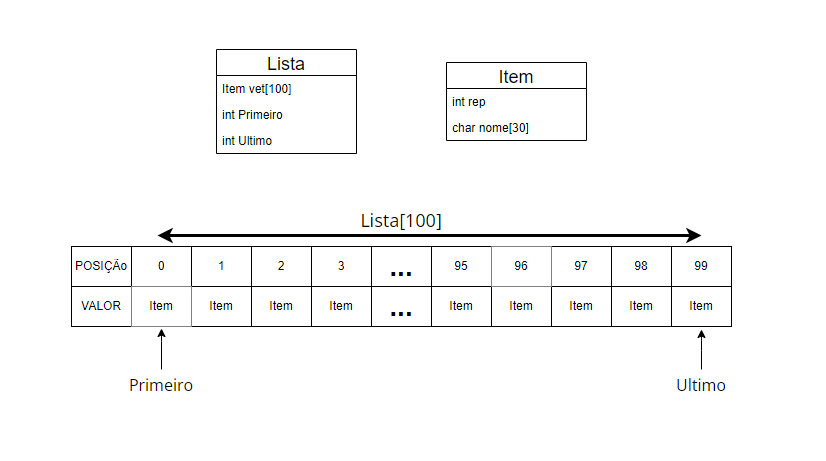
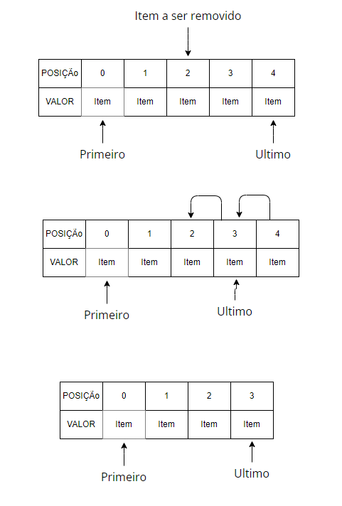
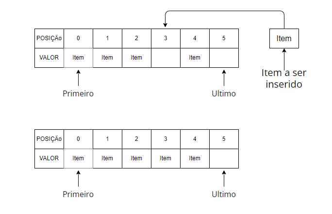
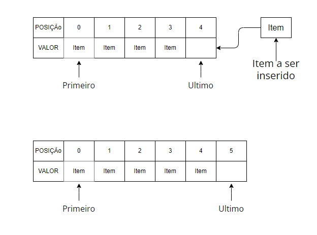
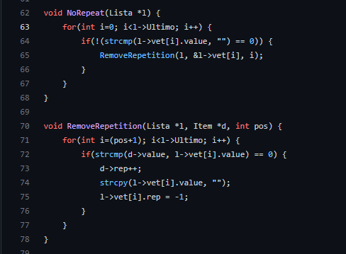

# Exercicio02

 
 

 
Crie uma lista linear que consiga armazenar um conjunto de 100 nomes quaisquer, os quais serão salvos de forma aleatória. Feito a estrutura crie as seguintes ações:
<ul>
  <li>Uma função que consiga identificar replicações na lista, ou seja, nomes iguais. Remova todas as réplicas sem mover os ”ponteiro“.</li>
  <li>Como você gerenciaria os espaços em branco para novas inserções? Qual seria o custo dessas novas inserções?</li>
</ul>

# Solução

A estrutura da lista linear que foi utilizada neste progama teve base nesta daqui [vide git]<a target="_blank" href="https://github.com/mpiress/linear_list">(https://github.com/mpiress/linear_list)</a>,as diferenças são que cada item desta lista tem um <strong>value</strong> do tipo char[] que é um nome e <strong>rep</strong> do tipo int que é o número de vezes que o nome foi inserido repetidamente. Abaixo está uma representação gráfiaca da estrutura.

 

Conforme a figura na Lista teremos  o vetor de 100 posições com os nomes e dois ponteiros o Primeiro aponta para o início do vetor de nomes e o Ultimo aponta para a última posição psossível para inserir do vetor com nomes

Para se remover utiliza-se a mesma método lógica do algoritmo citado está sendo primeiro achar a posição do item no vetor, depois puxar todos os itens à frente do item a ser removiodo uma posição e no final atualizar o ponteiro de Ultimo, a imagem a seguir ilustra está lógica.

Para inserir um item na lista usa-se a mesma lógica do algoritmo citado com um adicional que é antes de inserir algo na lista deve-se ver se existe algum espaço na lista em branco se exister o novo nome é inserido por cima senão é colocado no final da lista, isto é acontece por causa de todas as repetições da lista erem apagadas e transformadas em espaços livres a onde novos nomes podem ser inseridos. A figura abaixo mostra a difrença entre os dois jeitos de inserir.

Como todas as repetições devem ser apagadas o método abaixo foi criado para fazer isto. Ele pega um nome da lista procura se ele está repetido na lista se estiver a posição a nde está reperida é tornada em um espaço em branco e o número de repetições(<strong>rep</strong>) do nome sendo analisado aumenta em 1,  isto ocorre com todos os nomes da lista. O método pula espaço em brancos pois eles não representam um nome

Os espaçoes em brancos são tratados como espaços aonde novos nomes podem ser inseridos. O novo custo para inserções será o custo para verificar se há espaços em brancos se houver colocar por cima deles senão colocar na última posição mais o custo de inserir mais o custo para ver se a alguma repetição na lista e se houver transformar em espaço em branco.

# Compilação e Execução

O progama disponibilizado possui um arquivo Makefile que realiza todo o procedimento de compilação e execução. Para tanto, temos as seguintes diretrizes de execução:

| Comando                |  Função                                                                                           |                     
| -----------------------| ------------------------------------------------------------------------------------------------- |
|  `make clean`          | Apaga a última compilação realizada contida na pasta build                                        |
|  `make`                | Executa a compilação do programa utilizando o gcc, e o resultado vai para a pasta build           |
|  `make run`            | Executa o programa da pasta build após a realização da compilação                                 |
