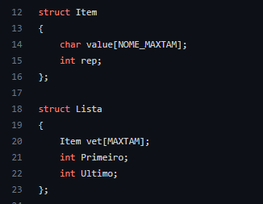
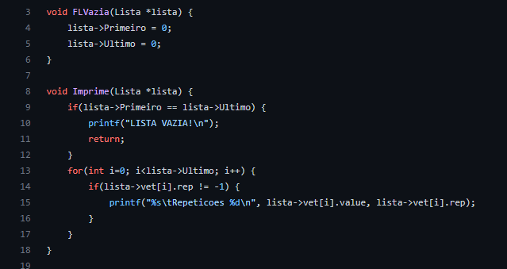
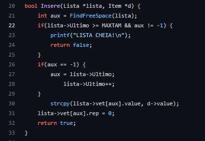
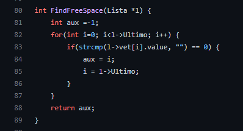
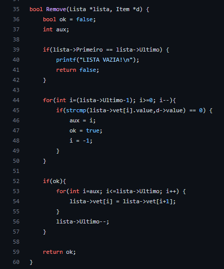
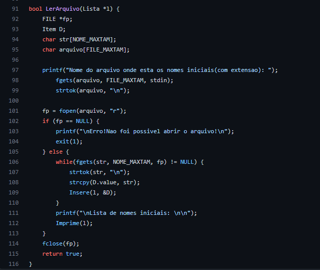

# Exercicio02

 
 

 
Crie uma lista linear que consiga armazenar um conjunto de 100 nomes quaisquer, os quais serão salvos de forma aleatória. Feito a estrutura crie as seguintes ações:
<ul>
  <li>Uma função que consiga identificar replicações na lista, ou seja, nomes iguais. Remova todas as réplicas sem mover os ”ponteiro“.</li>
  <li>Como você gerenciaria os espaços em branco para novas inserções? Qual seria o custo dessas novas inserções?</li>
</ul>

# Solução

Os espaçoes em brancos são tratados como espaços aonde novos nomes podem ser inseridos. O novo custo para inserções será o custo para verificar se há espaços em brancos se houver colocar por cim deles senão colocar na última posição mais o custo de inserir mais o custo para ver se le é repitido e se ele for repitido tornar ele um espaço em branco.

A estrutura da lista linear para este progama é, cada item desta lista tem um <strong>value</strong> do tipo char[] que é um nome e <strong>rep</strong> do tipo int que é o número de vezes que o nome repitiu:

 

Os métodos a seguir servem para deixar a lista vazia e para imprimmir a lista, na hora de imprimir não são mostrados os espaços em brancos que aparecem depois de remover as repetições:

Para inserir algum item na lista é utilizado o método a seguir, mas na hora de inserir é necessário procurar na lista se há algum espaço em branco na lista se haver o item é adicionado por cima senão haver espaço em branco o item é adicionado na ultima posição possível o método a lado mostra como é achado um espaço em branco:

Após a inserção de um item na lista precisa-se verificar se há algum nome repetido na lista que feito pelo método a seguir, quando um nome repetido é achado o valeu dele é mudado para vazio e rep para -1 para simbolizar que ele virou um espaço em branco:

Para remover algum item o progama utiliza o método a seguir:

Para preencher a lista linear com os nomes há um método que lé os nomes de um arquivo passado pelo usuário, após todos os nomes serem inseridos a lista o método NoRepeat é chamado para tirar os nomes repitidos:

# Compilação e Execução

O progama disponibilizado possui um arquivo Makefile que realiza todo o procedimento de compilação e execução. Para tanto, temos as seguintes diretrizes de execução:

| Comando                |  Função                                                                                           |                     
| -----------------------| ------------------------------------------------------------------------------------------------- |
|  `make clean`          | Apaga a última compilação realizada contida na pasta build                                        |
|  `make`                | Executa a compilação do programa utilizando o gcc, e o resultado vai para a pasta build           |
|  `make run`            | Executa o programa da pasta build após a realização da compilação                                 |
